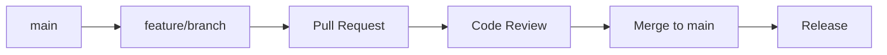

# 🚀 CI/CD Guide - IntelliCommerce✨ Woo MCP

Made with 🧡 in Cape Town 🇿🇦  
Powered by Xstra AI✨ | Enabled by IntelliCommerce✨

## 📋 Overview

The **IntelliCommerce✨ Woo MCP** project uses a comprehensive CI/CD pipeline with automated testing, dependency management, security auditing, and release automation.

## 🔄 Development Workflow

### Feature Branch Workflow

We use the **Feature Branch Workflow** for all development:



#### Branch Types
- **`main`** - Production-ready code (protected)
- **`feature/*`** - New features and enhancements
- **`fix/*`** - Bug fixes and patches  
- **`chore/*`** - Maintenance and updates

#### VS Code Tasks

Use VS Code tasks for streamlined workflow:

```bash
# Create feature branch
Ctrl+Shift+P → "Tasks: Run Task" → "🌿 Create Feature Branch"

# Push feature branch
Ctrl+Shift+P → "Tasks: Run Task" → "📤 Push Feature Branch" 

# Create pull request
Ctrl+Shift+P → "Tasks: Run Task" → "🔀 Create Pull Request"

# Cleanup after merge
Ctrl+Shift+P → "Tasks: Run Task" → "🧹 Cleanup Feature Branch"
```

## 🧪 Testing Pipeline

### Pre-commit Hooks (Husky + lint-staged)

Every commit triggers:

```bash
# 1. Lint staged files
# 2. Type checking
# 3. Unit tests  
# 4. Build validation
# 5. Commit message validation (commitlint)
```

### Test Automation

```bash
# Run full test suite
npm test

# Individual test suites
npm run test:unit         # Core functionality
npm run test:integration  # System integration
npm run test:mcp         # Protocol compliance
npm run test:e2e         # Workflows
npm run test:security    # Security validation

# Development testing
npm run test:watch       # Watch mode
npm run test:coverage    # Coverage report
npm run test:ci         # CI mode
```

## 📦 Dependency Management

### Automated Dependency Checks

```bash
# Check dependency status
npm run deps:check

# Security audit
npm run deps:audit

# Update strategies
npm run deps:update:patch      # Patch updates (1.0.0 → 1.0.1)
npm run deps:update:minor      # Minor updates (1.0.0 → 1.1.0)
npm run deps:update:major      # Major updates (1.0.0 → 2.0.0)

# Interactive updates
npm run deps:update:interactive

# Complete refresh
npm run deps:fresh            # Audit + Update + Validate
```

### Dependency Scripts

#### `scripts/dependencies-update.sh`

Comprehensive dependency management with:
- Automated security auditing
- Version compatibility checking
- Test validation after updates
- Rollback on failures
- Detailed logging

```bash
# Usage examples
./scripts/dependencies-update.sh patch
./scripts/dependencies-update.sh minor  
./scripts/dependencies-update.sh interactive
```

## 📈 Release Management

### Enhanced Release Process

#### `scripts/release-enhanced.sh`

Comprehensive release validation:

```bash
# Release types
npm run release:enhanced:patch   # 1.1.0 → 1.1.1
npm run release:enhanced:minor   # 1.1.0 → 1.2.0  
npm run release:enhanced:major   # 1.1.0 → 2.0.0

# Check release readiness
npm run release:check
```

#### Release Validation Steps

1. **🧹 Clean Working Directory** - Ensure no uncommitted changes
2. **🔒 Security Audit** - Scan for vulnerabilities  
3. **📝 Type Checking** - Validate TypeScript
4. **🔨 Build Test** - Ensure clean build
5. **🧪 Test Suite** - Run all tests
6. **📈 Changelog** - Generate enhanced changelog
7. **🔖 Version Bump** - Update version numbers
8. **🏷️ Git Tagging** - Create release tag
9. **📤 Publishing** - Push to npm registry

### Standard Releases

```bash
# Standard release process
npm run release:patch
npm run release:minor  
npm run release:major

# Dry run (preview changes)
npm run release:dry
```

## 📈 Changelog Management

### Automated Changelog Generation

#### `scripts/changelog-generator.sh`

Generates comprehensive changelogs with:

```bash
# Generate full changelog
npm run changelog:generate

# Dependency-focused changelog  
npm run changelog:deps

# Development changelog
npm run changelog:dev

# Update and commit changelog
npm run changelog:update
```

#### Changelog Sections

- **🚀 Features** - New functionality
- **🐛 Bug Fixes** - Issue resolutions
- **📝 Documentation** - Doc updates
- **🎨 Style** - Code formatting
- **♻️ Refactor** - Code restructuring
- **⚡ Performance** - Optimizations
- **✅ Tests** - Testing improvements
- **🔧 Chore** - Maintenance tasks
- **📦 Dependencies** - Dependency updates
- **🔒 Security** - Security improvements

## 🔒 Security & Quality

### Security Pipeline

```bash
# Security validation
npm run security:check

# Manual security audit
npm audit

# Fix vulnerabilities  
npm run deps:fix
```

#### `scripts/security-check.sh`

Comprehensive security scanning:
- Source code secret detection
- Dependency vulnerability scanning
- Configuration validation
- Security best practices checking

### Quality Assurance

```bash
# Type checking
npm run typecheck

# Code formatting
npm run format
npm run format:check

# Linting (disabled for upstream compatibility)
npm run lint

# Full validation pipeline
npm run validate
```

## 🏗️ Build Process

### Build Configuration

```bash
# Clean build
npm run clean && npm run build

# Watch mode (development)
npm run dev

# Production build
npm run build
```

### Build Validation

```bash
# Pre-publish validation
npm run pre-publish

# Test build package
npm run publish:test

# Dry run publish
npm run publish:npm:dry
```

## 📊 GitHub Actions

### Workflow Files

#### `.github/workflows/ci-cd.yml`

Main CI/CD pipeline:
- **Triggers**: Push to main, pull requests
- **Jobs**: Test, build, security scan, release
- **Node.js Versions**: 18.x, 20.x, 22.x
- **OS Matrix**: Ubuntu, macOS, Windows

#### `.github/workflows/dependencies.yml`

Automated dependency management:
- **Schedule**: Daily at 2 AM UTC
- **Tasks**: Security audit, update checks
- **Notifications**: Slack/email on issues

### Workflow Triggers

```yaml
# Push to main branch
on:
  push:
    branches: [main]

# Pull requests
on:
  pull_request:
    branches: [main]

# Release creation  
on:
  release:
    types: [published]

# Manual trigger
on:
  workflow_dispatch:
```

## 🚀 Deployment Pipeline

### npm Publishing

```bash
# Automated publishing (with release)
npm run publish:auto

# Manual publishing
npm run publish:npm

# Global installation
npm run global:install
npm run global:test
```

### Package Validation

```bash
# Package integrity check
npm pack --dry-run

# Test installation
npm run publish:test
```

## 📱 VS Code Integration

### Tasks Configuration

Located in `.vscode/tasks.json`, provides 20+ automated tasks:

#### Build Tasks
- ✨ Build IntelliCommerce✨ Woo MCP
- 🔄 Watch & Build IntelliCommerce✨ Woo MCP  
- 🧹 Clean Build Directory

#### Git Workflow Tasks
- 🌿 Create Feature Branch
- 📤 Push Feature Branch
- 🔀 Create Pull Request  
- 🧹 Cleanup Feature Branch
- ⬆️ Sync with Upstream

#### Dependency Tasks
- 📦 Check Dependencies
- 🔒 Audit Dependencies  
- 🩹 Update Patch Dependencies
- 📈 Update Minor Dependencies
- 🎯 Interactive Dependency Update
- 🌿 Fresh Dependencies

#### Release Tasks
- 📈 Generate Changelog
- 🔖 Release Patch Version
- 🔖 Release Minor Version

### Debug Configuration

Located in `.vscode/launch.json`:

```json
{
  "name": "Debug MCP Server",
  "type": "node", 
  "request": "launch",
  "program": "${workspaceFolder}/build/server.js",
  "envFile": "${workspaceFolder}/.env"
}
```

## 🔧 Configuration Files

### Essential Config Files

#### `commitlint.config.cjs`
Validates commit message format with emoji support:

```javascript
module.exports = {
  extends: ['@commitlint/config-conventional'],
  rules: {
    'subject-case': [0],
    'type-enum': [2, 'always', [
      '✨ feat', '🐛 fix', '📝 docs', '🎨 style',
      '♻️ refactor', '⚡ perf', '✅ test', '🔧 chore'
    ]]
  }
};
```

#### `.lintstagedrc.json`
Pre-commit hook configuration:

```json
{
  "src/**/*.{ts,js}": [
    "echo '✨ IntelliCommerce✨ - Skipping lint for upstream compatibility'"
  ],
  "*.{json,md}": [
    "echo '✨ IntelliCommerce✨ - Made with 🧡 in Cape Town 🇿🇦'"
  ]
}
```

#### `.release-it.json`
Release automation configuration:

```json
{
  "git": {
    "commitMessage": "🚀 chore(release): ${version}",
    "tagName": "v${version}"
  },
  "npm": {
    "publish": false
  },
  "hooks": {
    "after:bump": "npm run build && npm test"
  }
}
```

## 🐛 Troubleshooting

### Common CI/CD Issues

#### Build Failures
```bash
# Clear caches
npm ci
rm -rf node_modules package-lock.json
npm install

# Rebuild
npm run clean && npm run build
```

#### Test Failures
```bash
# Environment issues
cp .env.example .env
# Edit .env with valid credentials

# Dependency issues  
npm run deps:fresh
```

#### Release Issues
```bash
# Check release readiness
npm run release:check

# Manual release steps
npm run changelog:generate
npm run release:patch
git push --follow-tags origin main
npm publish
```

### Debugging Pipeline

#### Local Pipeline Testing
```bash
# Simulate CI environment
export NODE_ENV=test
npm ci
npm run build
npm test
npm run security:check
```

#### Git Hook Issues
```bash
# Reinstall hooks
npm run husky:install

# Test hooks
git commit --allow-empty -m "test: Testing hooks"
```

## 📚 Best Practices

### Commit Messages
Follow conventional commits with emojis:

```bash
✨ feat: Add new WooCommerce integration
🐛 fix: Resolve authentication timeout issue  
📝 docs: Update API documentation
🔧 chore: Update dependencies
```

### Branch Naming
Use descriptive branch names:

```bash
feature/add-customer-management
fix/authentication-timeout
chore/update-dependencies  
docs/api-documentation
```

### Release Notes
Include comprehensive release notes:

- **New Features**: What's new
- **Bug Fixes**: What's fixed
- **Breaking Changes**: What changed
- **Dependencies**: What's updated
- **Migration**: How to upgrade

---

**Made with 🧡 in Cape Town 🇿🇦**  
**Powered by Xstra AI✨ | Enabled by IntelliCommerce✨**
